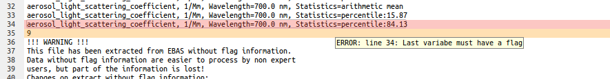
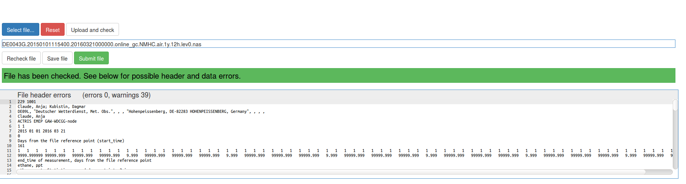

How to use EBAS Data Submission Tool
============

Go to [http://ebas-submit-tool.nilu.no/](http://ebas-submit-tool.nilu.no/)

Make sure that the file is a NASA Ames 1001 EBAS formatted file, as described from the templates at [http://ebas-submit.nilu.no/](http://ebas-submit.nilu.no/) or [http://www.gaw-wdca.org](http://www.gaw-wdca.org). 

	Please note, that for the time being, 
	the system does not handle complete particle number size distribution files, 
	This is due to size limitations in the set-up during test phase of the system. 
	It is, however, possible to check file headers for these files.

> Press the **Select file** button to select file from local directory

> Check file against the EBAS database tables by pressing the **Upload and check** button. Depending on the file size, this might take up to 1 minute.

> The number of header errors and warnings, and data errors and warnings, are separated in two different windows.

> Errors and warnings are marked in red and orange, respectively.

> Pointing the mouse pointer on the highlighted line will show the error/warning message

> Errors in file header can be corrected directly in the online browser. It is possible to correct all errors in one batch before re-checking the file. When done with the corrections, press the **Recheck file** botton. 

> Errors in the data part must be corrected locally on the user’s PC. Before the local modifications take place, it is possible to save and store the file modified in the web-tool to the local disc to include the modified header in the locally modified file. This is achieved by pressing the **Save file** button. The file is then downloaded to the data submitter’s local computer and can be opened there for editing. The figure below gives an example of a file with errors in the datapart.

> **Reset the system. Select file. Upload and check.**

> If/when file is correct, the statusbar will turn green and the **Submit file** button is activated. Upon submit, the file is sent to the EBAS FTP system, and an auto-email is sent to the data submitter. After entering the FTP system, the NASA Ames file is forwarded to manual inspection at NILU. 

--------  -----------------------
**Post-processing inside NILU:** 
Before the data can be uploaded to EBAS, the submitted file will need manual inspection by the database team. If the file is correctly formatted, data will be available in EBAS within a few working days. The data submitter will be informed when this is done. He/she will also be contacted in case of problems with, or questions to, the submitted file.
--------  -----------------------

